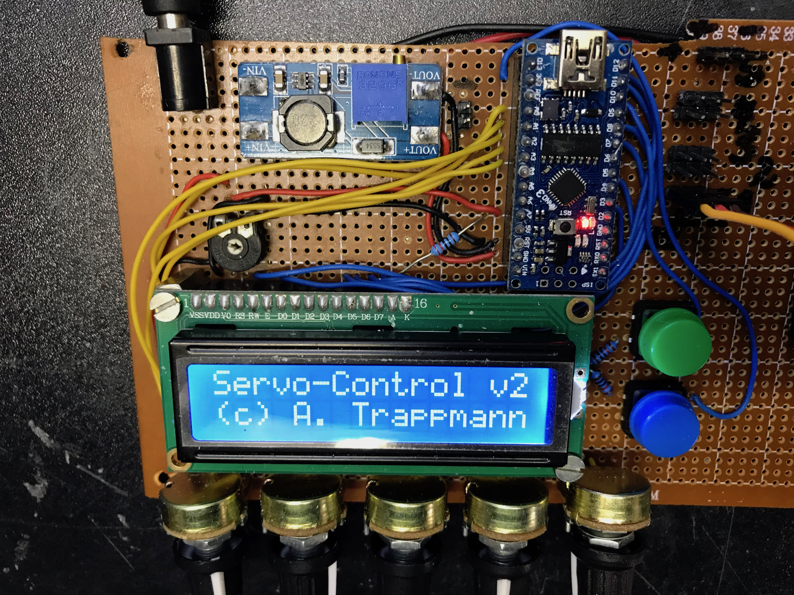
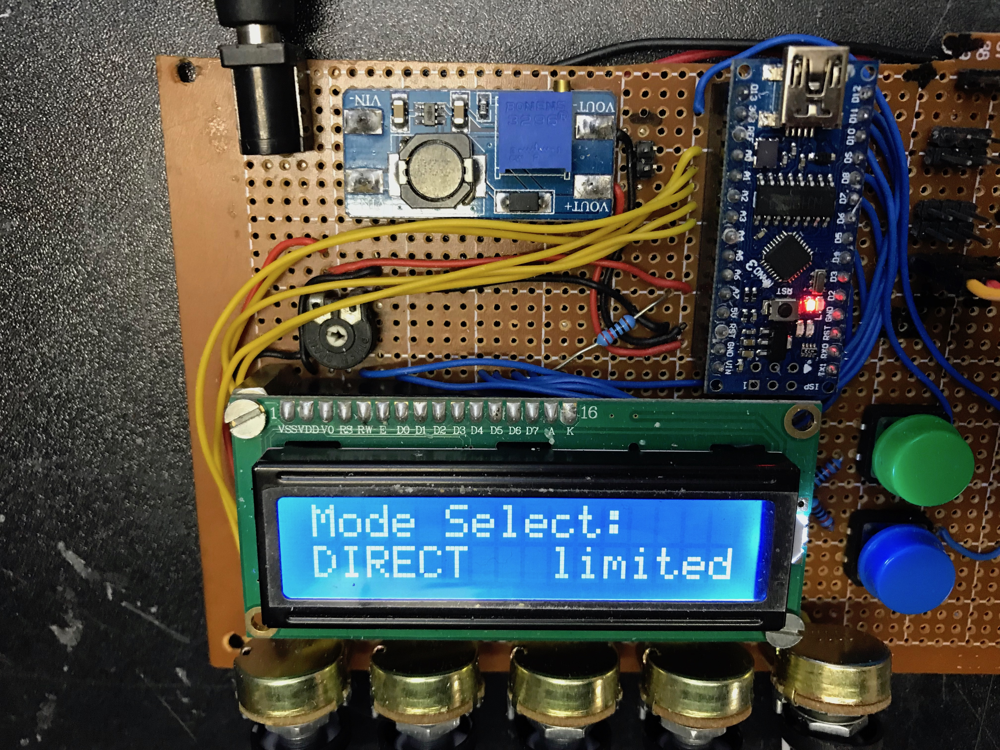
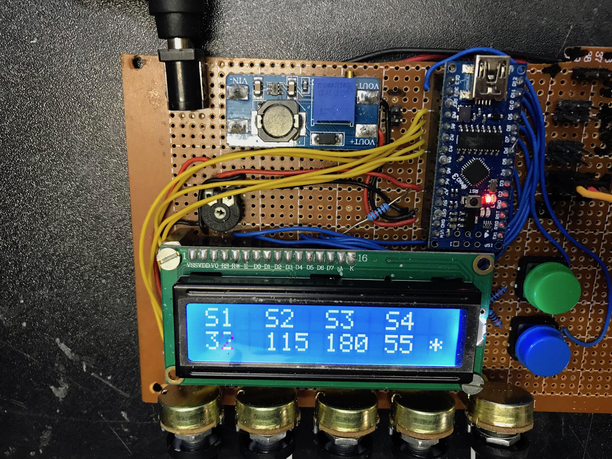
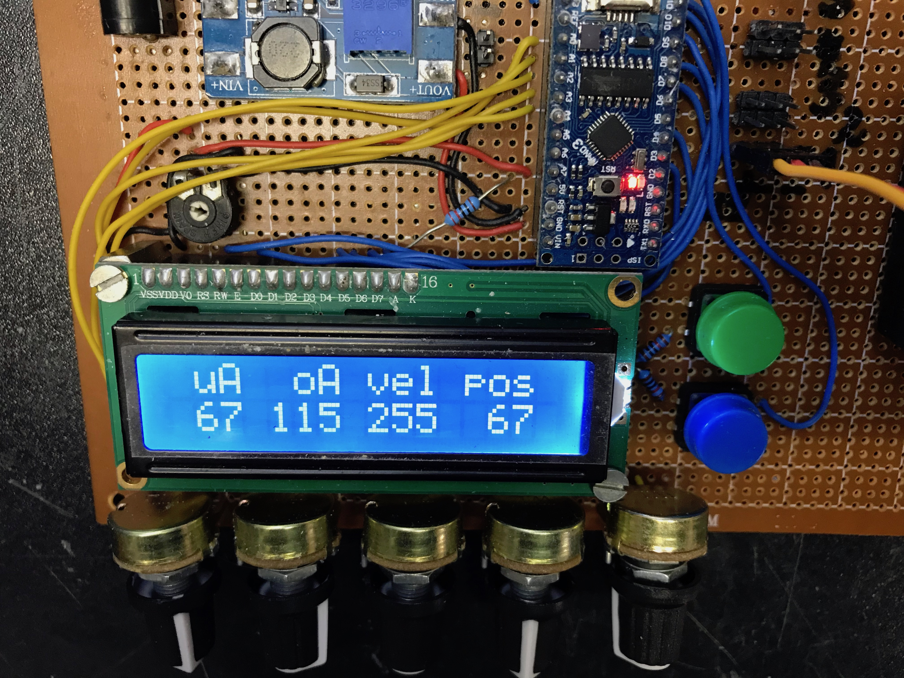

# Servo-Controller V2

Arduino Nano based Servo-Controller used in my robotic projects after 
installation of new servos. Before starting the designated control software
for the whole robot, this sketch on an Arduino Nano with its related Shield
allows testing each servo one-by-one for its allowed movement radius. Up to
4 servos are supported. 

The status is displayed on a small 20x2 character LCD, showing the current
settings with its lower and upper limits of action radius. If the onboard
LED is on, servos are ready to move and follow any change in position. By
pressing the button ModeControl at any time, all servos stop immediatly and
are released from control (no PWM signal any more). This does protect the 
robot mechanics, if the servo turns in the wrong direction or is going to
move beyond the mechanical boundaries of a joint.
 

The new Servo-Controller does support 2 modes of operation:
	* Direct Mode
	* Limited Mode

Direct Mode does allow control of 4 servos at the same time. Each potentiometer 
gives a direct signal for the servo PWM controller.

Limited Mode allows only control for 1 servo. The first 2 potentiometers are used
to regulate the lower and upper limit of the movement area of the servo.
The 3rd pot regulates velocity and the 4th pot the actual position.

 
The circuit schematic is quite simple. The only "strange" thing is the step-up
module MT3608 which raises the 6V battery power to about 7.5V. This is 
necessary, because the voltage regulation circuit from the Nano needs about 
1V to function. The recommendation is a power supply not unter 7V.
The MT3608 module is probably obsolete if you power the ServoControllerV2 
with a 7.4V Lipo-Battery.

Release Notes:
	
Version 2.0 - 29.08.2018

	* Initial version
